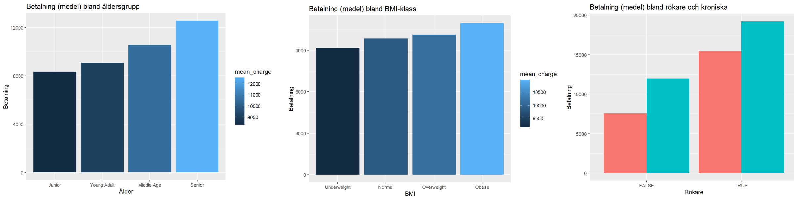
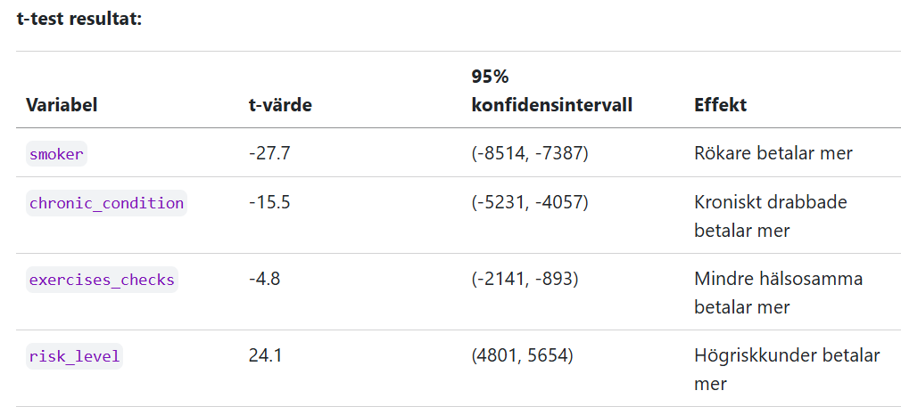
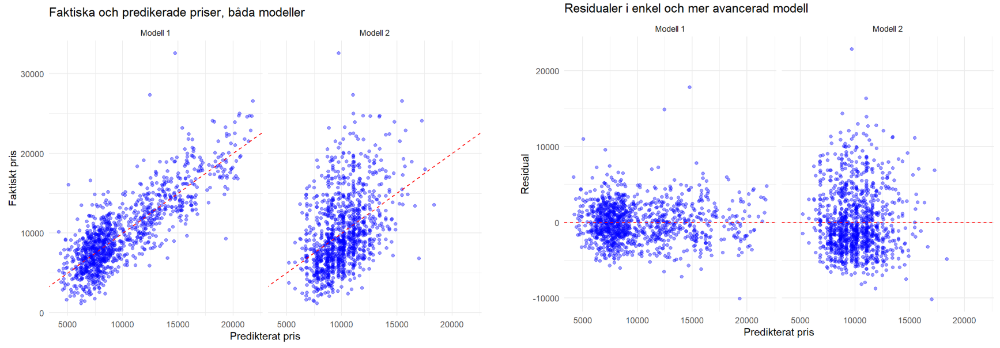
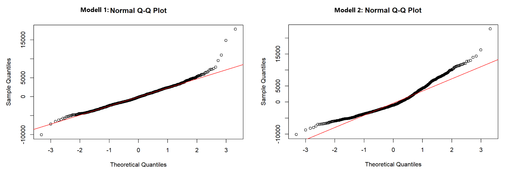

# 🏥 Insurance Cost Analysis with R

> Ett datadrivet projekt som kartlägger vilka faktorer som driver försäkringspremier, med R, Tidyverse och statistisk modellering.

## Översikt

Detta projekt utforskar prissättningen av försäkringspremier genom en fullständig dataanalysresa: från städning och feature engineering till statistiska hypotestester och prediktiv modellering med linjär regression.

### Huvudsakliga insikter

| Insikt | Beskrivning |
|--------|-------------|
| 🚬 **Livsstil före demografi** | Rökning och kroniska sjukdomar har en betydligt större inverkan på priset än ålder och BMI |
| ⚖️ **Precision vs. Tolkbarhet** | En modell på rådata förklarar ~69% av prisvariationen, medan en kategoriserad modell är lättare att förstå men tappar i precision (~17%) |
| 📂 **Historik spelar roll** | Tidigare ärenden (claims) är en statistiskt signifikant prediktor som bör inkluderas i prissättningsmodeller |

---

## Regressionsmodeller

Projektet jämför två angreppssätt för att förutsäga kostnader (`charges`):

### Modell 1 — Kontinuerlig (Hög precision)

- **Variabler:** `age`, `bmi`, `smoker`, `chronic_condition`
- **R²:** `0.69` – förklarar 69% av prisvariansen
- **Syfte:** Maximera träffsäkerhet i prissättning

### Modell 2 — Kategorisk (Affärsfokuserad)

- **Variabler:** `age_group`, `bmi_class`, `plan_type`, `historic_score`
- **R²:** `0.17`
- **Syfte:** Skapa tydliga segment för marknadsföring och säljbeslut

---

## Visualer

**Prisutveckling per kategori**: åldersgrupper, BMI-klasser och rökning/sjukdomshistorik.

**Hypotestester**: t-test för att undersöka statistiskt signifikanta skillnader mellan grupper.

**Regressionsdiagnostik**: faktiskt vs. predikerat pris samt residualspridning för båda modellerna.

**Normalfördelning av residualer**: QQ-plottar för Modell 1 och Modell 2.

---
